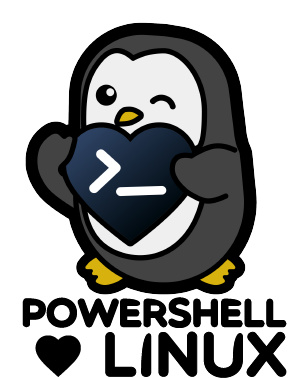

# nxtools [](https://synedgy.visualstudio.com/nxtools/_build?definitionId=10&_a=summary)


[](https://www.powershellgallery.com/packages/nxtools/)
[](https://www.powershellgallery.com/packages/nxtools/)
[](https://synedgy.visualstudio.com/nxtools/_test/analytics?definitionId=10&contextType=build)


Collection of Posix tools wrappers.

## Introduction

- `Get-nxKernelInfo`: A simple wrapper around `uname -a`.
- `Get-nxLinuxStandardBaseRelease`: A quick wrap of `lsb_release -a` command (this `lsb_release` must be present on the system).
- `Get-nxDistributionInfo`: Parsing information found in `/etc/*-release`.
- `Get-nxItem`: Similar to Get-Item for file system provider but on Linux using `ls -d`.
- `Get-nxChildItem`: Similar to Get-ChildItem for the FileSystem provider but on Linux, this will use the `ls` command.
- `Compare-nxFileSystemMode`: An easy way to compare two sets of unix file system permissions.  
    You can use a Symbolic notation (`rwxrwxrwx`), or the numericla permission (`777` or `0777`).
- `Get-nxLocalUser`: Read and parse local users from `/etc/passwd`.
- `Get-nxLocalGroup`: Read and parse local groups from `/etc/group`.
- `Set-nxMode`: Set files and folder mode (permisisons) using `chmod`.
- `Set-nxOwner`: Set the owner for files and folders (and optionally the group ownership) using `chown`.
- `Set-nxGroupOwnership`: Set the group owning the files and folders using `chgrp`.

# Usages

```powershell

Get-nxKernelInfo # uname -a

Get-nxDistributionInfo  # cat /etc/*-release

Get-nxLinuxStandardBaseRelease # lsb_release -a (not available by default on some Debian 10, Alpine and others)

Get-nxLocalUser # cat /etc/passwd
Get-nxLocalUser -UserName (whoami)
Get-nxLocalUser -Pattern '^gcolas$'

Get-nxLocalGroup # cat /etc/group
Get-nxLocalGroup tape | Get-nxLocalUser

Get-nxItem /tmp/testdir
(Get-nxItem /tmp/testdir).Mode
(Get-nxItem /tmp/testdir).Mode.ToString()
(Get-nxItem /tmp/testdir).Mode.ToOctal()

# using module output/nxtools
# using module nxtools
[nxFileSystemMode]'rwxr--r--'
[nxFileSystemMode]'ugo=rwx'
[nxFileSystemMode]'1777'
[nxFileSystemMode]'u=rwx g=r o=r'

# Proper handling of symbolic links not yet implemented
Compare-nxMode -ReferenceMode 'r--r--r--' -DifferenceMode 1777 | FT -a
Get-nxChildItem -Path /tmp/testdir | Compare-nxMode -ReferenceMode 'r--r--r--' | FT -a

Get-nxChildItem /tmp/testdir/ -File | FT -a
Get-nxChildItem /tmp/testdir/ -Directory | FT -a
Get-nxChildItem /tmp/testdir/ | FT -a
Get-nxChildItem /tmp/testdir/ -File | Move-Item -Destination /tmp/testdir/otherdir/ -Verbose
Get-nxChildItem /tmp/testdir/ -File | FT -a
Get-nxChildItem /tmp/testdir/ -File -recurse | FT -a

Set-nxMode -Path /tmp/tmpjBneMD.tmp -Mode 'rwxr--r--' -Recurse -WhatIf  # chmod -R 0744
Set-nxMode -Path /tmp/tmpjBneMD.tmp -Mode '0744' -Recurse -WhatIf       # chmod -R 0744
Set-nxMode -Path /tmp/tmpjBneMD.tmp -Mode 744 -Recurse -Whatif          # chmod -R 0744

# Get the other groups the members of the tape group are member of
Get-nxLocalGroup tape | Get-nxLocalUser | Get-nxLocalUserMemberOf

Set-nxOwner -Path /tmp/tmpjBneMD.tmp  -Owner (whoami) # chown gcolas /tmp/tmpjBnedMD.tmp

Set-nxGroupOwnership -Path /tmp/testdir -Recurse -Group users -RecursivelyTraverseSymLink


```


## Notes

Thanks [SoSplush](https://sosplush.com/) ([@SoSplush](https://twitter.com/SoSplush)) for the Tux design.
